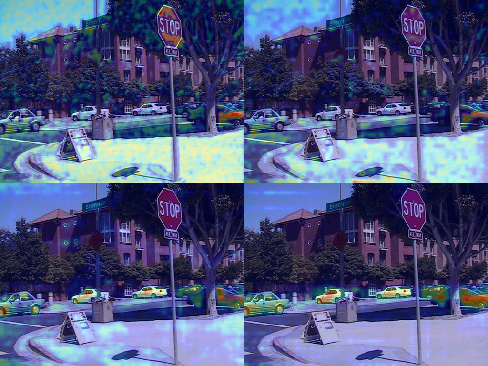

Gradient-weighted Class Activation Mapping，即Grad-CAM，是利用流入最后一个卷积层的任意目标概念（比如"狗"的对数概率甚至是一段描述文本）的梯度，生成一张粗糙的定位图，突出图像中对预测该概念而言的重要区域。

## Grad-CAM 原理

其计算公式如下：

先利用梯度计算加权值

$$
\alpha_{k}^{c}=\overbrace{\frac{1}{Z} \sum_{i} \sum_{j}}^{\text{global average pooling}} \underbrace{\frac{\partial y^{c}}{\partial A_{k j}^{i}}}_{\text{gradients via backprop}}
$$

然后对特征图进行加权

$$
L^c_{\text{Grad-CAM}} = \operatorname{ReLU}\left( \underbrace{\sum_{k} \alpha_k^c A^k}_{\text{linear combination}} \right)
$$


其中 $A^k$ 通常表示特征提取模块的输出的第$k$个通道，称为第$k$个特征图，位于激活函数之前一般来说会选用最后一个卷积层。这是因为:

> A number of previous works have asserted that deeper representations in a CNN capture higher-level visual constructs [5, 31]. Furthermore, convolutional features naturally retain spatial information which is lost in fully-connected layers, so we can expect the last convolutional layers to have the best compromise between high-level semantics and detailed spatial information. The neurons in these layers look for semantic class-specific information in the image (say object parts).

即最后一层卷积层可以平衡高层语义和空间信息。

对于公式可以这样理解，$y^c$代表目标得分（剔除其他贡献），其值越高代表所属类别越大可能/图文越匹配。特征提取网络输出的不同特征图关注着图像中的不同位置，其中梯度贡献越大的层说明其关注到了图像中有助于增大目标得分的位置，据此对所有特征图进行加权便可以得到模型整体关注图像中的位置。最后再过 ReLU 只保留对类别有正向贡献的区域（负梯度抑制无关背景）。


## 具体示例

以图像分割为例，我们以下图使用deeplabv3做图像分割，并分析当目标设置为`car`时，模型主要关注哪些区域


首先需要获取对于剔除其他类别因素模型输出结果关于`car`的得分，以及我们想要关注的卷积层

```python
class SemanticSegmentationTarget:
    def __init__(self, category, mask):
        self.category = category
        self.mask = torch.from_numpy(mask)
        if torch.cuda.is_available():
            self.mask = self.mask.cuda()

    def __call__(self, model_output):
       return (model_output[0, self.category, :, :] * self.mask).sum()

targets = [SemanticSegmentationTarget(car_category, car_mask_float)]

target_layers = [model.model.backbone.layer4]
```

进行梯度计算时，我们可以利用pytorch将输入前向传播后得到输出，然后手动反向传播，并在我们想要关注的层设置`hook`获取特征图和梯度信息（关于hook可见 [backward_hook](https://docs.pytorch.org/docs/2.11/generated/torch.nn.Module.html#torch.nn.Module.register_full_backward_hook)和[forward_hook](https://docs.pytorch.org/docs/2.11/generated/torch.nn.modules.module.register_module_forward_hook.html)）

```python
input_tensor.requires_grad = True

# 存储：特征图、梯度
activations = []
gradients = []


    # 前向钩子：保存特征图
def forward_hook(module, inp, out):
    activations.append(out)

# 反向钩子：保存梯度
def backward_hook(module, grad_in, grad_out):
    gradients.append(grad_out[0])

# 给目标层注册钩子
handles = []
for layer in target_layers:
    handles.append(layer.register_forward_hook(forward_hook))
    handles.append(layer.register_full_backward_hook(backward_hook))

# 前向传播
output = model(input_tensor)

# 计算目标分数（要反向传播的标量）
target_score = targets[0](output)

# 反向传播，计算梯度
model.zero_grad()
target_score.backward(retain_graph=True)

# 获取特征图和梯度
act = activations[0]  # shape: (1, C, H, W)
grad = gradients[0]  # shape: (1, C, H, W)

# 梯度全局平均池化 → 得到每个通道的权重
weights = grad.mean(dim=(2, 3), keepdim=True)  # (1, C, 1, 1)

# 权重 × 特征图 → 加权求和
cam = (weights * act).sum(dim=1, keepdim=True)  # (1, 1, H, W)

# ReLU 只保留正贡献
cam = F.relu(cam)

# 上采样到原图大小
cam = F.interpolate(
    cam,
    size=rgb_img.shape[:2],
    mode="bilinear",
    align_corners=False
)

# 归一化到 0~1
cam = cam.squeeze().cpu().detach().numpy()
cam = (cam - cam.min()) / (cam.max() - cam.min() + 1e-8)
```

最后叠加到原图上显示即可获得模型关注的图像空间位置



如图所示，deeplabv3的layer1~4，模型是越来越关注到目标区域的。

完整代码可见 [https://www.kaggle.com/code/x007ff/grad-cam](https://www.kaggle.com/code/x007ff/grad-cam)