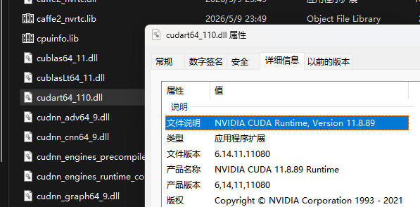

## 如何选择合适的torch版本

我们首先明确一个结论：安装支持 CUDA 的 PyTorch，前提条件是**拥有 NVIDIA GPU，并且显卡驱动支持的 CUDA 版本高于或等于编译 PyTorch whl 包时所使用的 CUDA Toolkit 版本**。这一点从官方文档中可以得到印证：

> Additionally, to check if your **GPU driver** and CUDA is enabled and accessible by PyTorch, run the following commands to return whether or not the **CUDA driver** is enabled:

CUDA API分为Runtime API和CUDA Driver API（详见[cuda-platform-driver-and-runtime](https://docs.nvidia.com/cuda/archive/13.1.0/cuda-programming-guide/01-introduction/cuda-platform.html#cuda-platform-driver-and-runtime)），其中

> The CUDA runtime API is implemented on top of a lower-level API called the CUDA driver API, which is an API exposed by the NVIDIA Driver.

PyTorch 的 GPU 加速依赖于 cuDNN，cuDNN 依赖 CUDA Toolkit，而 CUDA Toolkit 则建立在 Runtime API 之上。关键在于，PyTorch 在编译发布时**就已经内建包含了**对应版本的 CUDA Runtime API 动态库。例如，我们使用如下命令安装：

```sh
pip3 install torch torchvision --index-url https://download.pytorch.org/whl/cu126
```

安装完成后，在 `Lib\site-packages\torch\lib` 目录下可以看到相关自带依赖：



因此，只要安装了NVIDIA Driver，并且其CUDA版本（可以通过`nvidia-smi`得到）大于torch编译时所使用的cuda版本，即可使用GPU加速的torch。实际上我们无需安装CUDA Toolkit。

## 如何快速的安装torch

官方提供的标准安装指令如下（以 CUDA 12.6 版本为例）：

```sh
pip3 install torch torchvision --index-url https://download.pytorch.org/whl/cu126
```

可以使用镜像源加速（[NJU Mirror](https://mirrors.nju.edu.cn/pytorch/whl)）

```sh
pip3 install torch torchvision --index-url https://mirrors.nju.edu.cn/pytorch/whl/cu126
```

> **注意：** 必须使用专用的 PyTorch whl 镜像源地址，通常的 pip 全局镜像源（如清华源 pypi 目录、阿里源等）无法直接加速带有 `--index-url` 指定的特定 CUDA 版本包。
